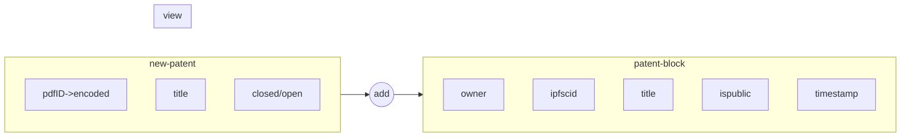

# CLAIM
### Decentralized Idea Proof Platform

CLAIM – Decentralized Idea Proof Platform allows any user to:

- Upload a description and file (e.g., PDF) of their idea.
- Connect a wallet like MetaMask for identity.
- Mint a unique NFT (Non-Fungible Token) that proves the idea was theirs — with a timestamp.
- Store the document in decentralized storage (IPFS).
- View and share their proof publicly.

This provides quick, tamper-proof, and transparent proof that the idea existed — helping defend against future disputes or infringements.

