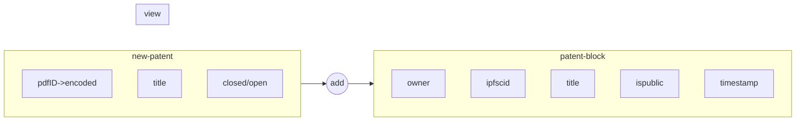

# CLAIM

```mermaid
graph LR
subgraph patent-block
   a[owner]
   b[ipfscid]
   c[title]
   d[ispublic]
   e[timestamp]
end

subgraph new-patent
    f[pdfID->encoded]
    g[title]
    h[closed/open]
end
new-patent-->i
    i((add))-->patent-block
    
subgraph view

end
```
