# CLAIM (PROTOTYPE)
`Decentralized Government-Verified Idea Proof Platform`
`social media for uploading patents`

  

  
  
  
  

---

## 🚀 Overview

**CLAIM** is a decentralized platform that provides **government-verified patent uploading platform**.  
By leveraging **Ethereum blockchain** and **Pinata (IPFS)**, CLAIM ensures that patents are:

- **Tamper-proof**
- **Properly indexed**
- **Future-proof and globally discoverable**

> ⚠️ **Important:** Only patents officially verified by government authorities can be submitted and minted on CLAIM.

---

## ✨ Key Features

- **🔒 Government Verification Required**  
  Only patents confirmed via official databases (e.g., IPO India, WIPO) can be added.  

- **📂 Indexed & Permanent Storage**  
  Patents are stored on **Pinata (IPFS)** with cryptographic hashing for easy retrieval and long-term accessibility.  

- **⛓ Immutable Blockchain Proof**  
  Ownership, metadata, and timestamps are stored permanently on **Ethereum**.  

- **🌐 Public Innovation Network**  
  Verified patents are showcased publicly for visibility, collaboration, and credibility.  

- **🛡 Transparent & Auditable**  
  Anyone can verify the authenticity of patents directly via blockchain data.

---

## 🛠 How It Works

1. **Connect Wallet (MetaMask)** – Authenticate via Ethereum wallet.  
2. **Submit Patent Details** – Upload PDF and metadata.  
3. **Government Verification API** – Cross-checks and verifies authenticity.  
4. **Mint Patent NFT** – Creates an immutable record on Ethereum.  
5. **Store on Pinata (IPFS)** – Files are stored and indexed permanently.  
6. **Public Display** – Verified patents appear on the CLAIM platform.

---

## 🏗 Architecture

```mermaid
graph TD
subgraph patent-block
   a[Owner Wallet Address]
   b[IPFS CID -Pinata]
   c[Patent Title]
   d[Govt Verification Flag]
   e[Timestamp]
end

subgraph new-patent
    f[PDF ID → Encoded Metadata]
    g[Title / Metadata]
    h[Closed/Open Access]
end
new-patent-->i
i((Add → Verify → Mint))-->patent-block
```

## 🌐 Prototype
👉 Try it live: https://claim-nexbit.vercel.app

